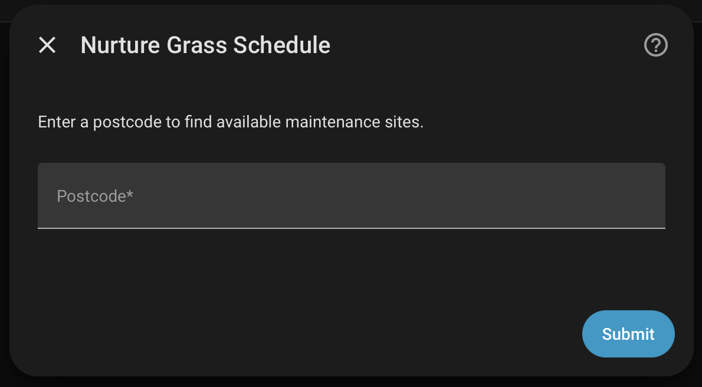
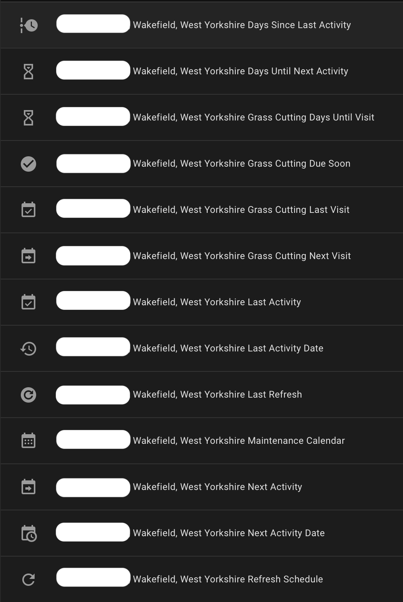
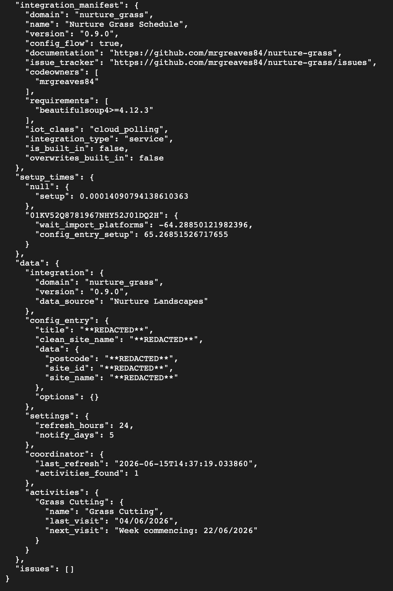
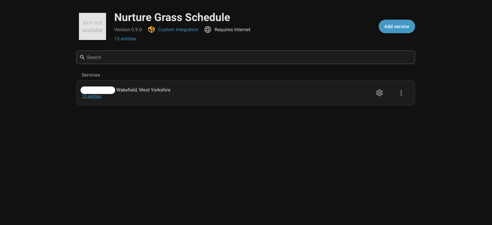
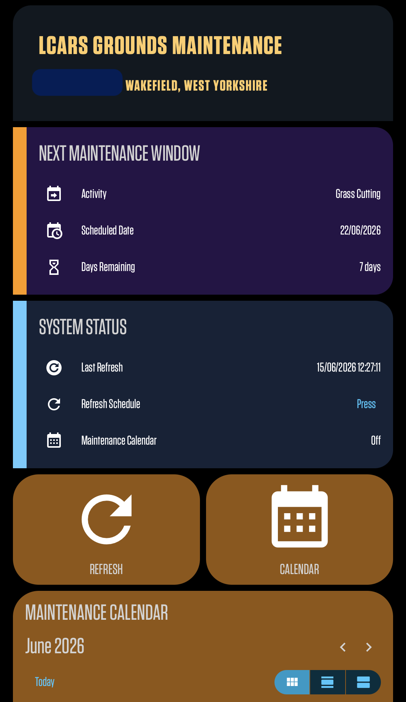
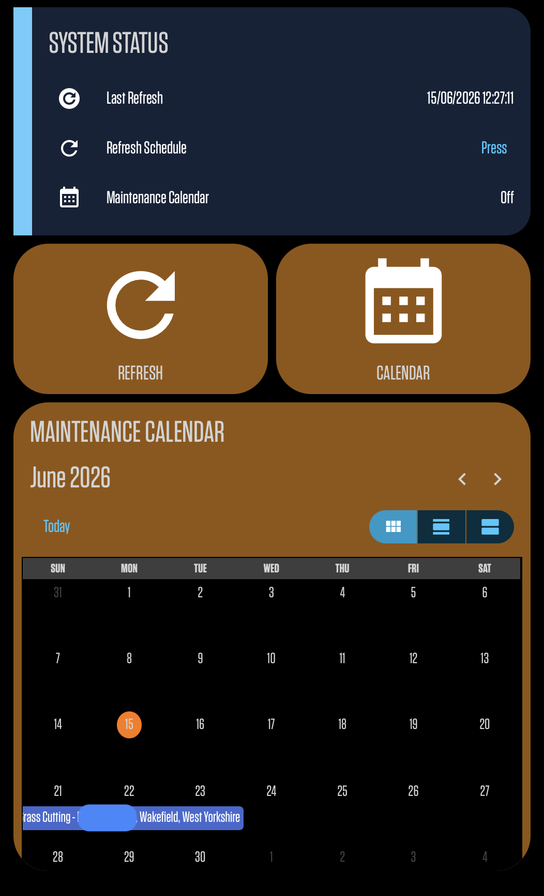
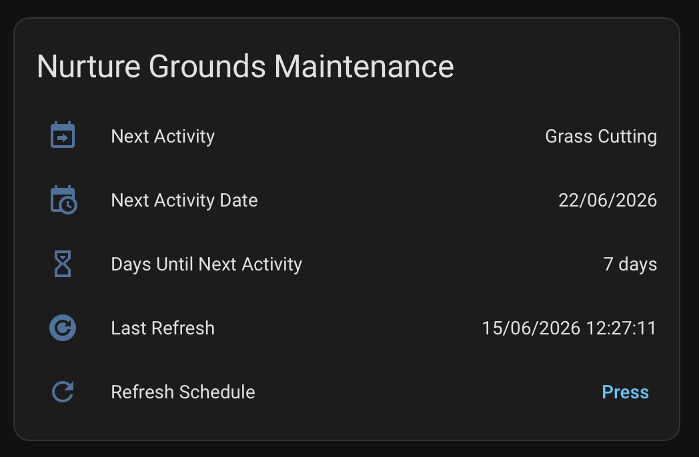

# Nurture Grass Schedule

  

Home Assistant integration for the Vico Homes Grounds Maintenance Portal, providing maintenance schedules, calendars, notifications and activity tracking.

## Overview

Nurture Grass Schedule integrates the Vico Homes Grounds Maintenance Portal with Home Assistant, allowing residents to monitor upcoming grounds maintenance activities directly from their Home Assistant installation.

The integration automatically retrieves maintenance schedules and exposes them as Home Assistant entities, including sensors, binary sensors, calendar events, and notifications.

While initially developed for grass cutting schedules, the integration is designed to support additional maintenance activities such as hedge trimming and other grounds maintenance services as they become available through the portal.

## Features

| Feature | Supported |
|----------|----------|
| Calendar Entity | ✅ |
| Refresh Button | ✅ |
| Diagnostics | ✅ |
| Repairs | ✅ |
| Config Flow | ✅ |
| Options Flow | ✅ |
| HACS Compatible | ✅ |
| Dashboard Examples | ✅ |
| Multi-language Framework | ✅ |

## Compatibility

Tested with:

- Home Assistant 2026.6+
- Home Assistant OS
- Home Assistant Container
- HACS
  
## Installation

### HACS Installation

1. Open HACS.
2. Select Integrations.
3. Open the menu and choose Custom Repositories.
4. Add:

   https://github.com/mrgreaves84/nurture-grass

5. Select Category: Integration.
6. Install Nurture Grass Schedule.
7. Restart Home Assistant.
   
### Manual Installation

1. Download the latest release.
2. Copy the `custom_components/nurture_grass` folder into your Home Assistant `custom_components` directory.
3. Restart Home Assistant.
4. Add the integration through Settings → Devices & Services.

## Configuration

1. Add the integration.
2. Enter your postcode.
3. Select your maintenance site.
4. Configure optional refresh and notification settings.
5. Save the configuration.
   
## Configuration Example

The integration uses a guided configuration flow with postcode lookup and automatic site discovery.

## Entities

| Entity Type | Description |
|------------|-------------|
| Sensor | Next activity |
| Sensor | Next activity date |
| Sensor | Days until next activity |
| Sensor | Last refresh |
| Binary Sensor | Activity due soon |
| Calendar | Maintenance calendar |
| Button | Refresh schedule |

## Entity Overview

The integration automatically creates sensors, binary sensors, a calendar entity and a refresh button.

## Notifications

The integration can generate notifications before scheduled maintenance visits using configurable lead times.

## Future Activity Support

The integration is designed to support any maintenance activity exposed by the Vico Homes Grounds Maintenance Portal, including:

- Grass Cutting
- Hedge Trimming
- Grounds Maintenance
- Future activity types added by the portal
  
## Diagnostics

Diagnostics can be downloaded directly from the integration menu and are designed to assist with troubleshooting while avoiding unnecessary exposure of personal information.

## Diagnostics Example

Built-in diagnostics provide troubleshooting information while automatically redacting sensitive information.

### Privacy

Diagnostics automatically redact sensitive information including:

- Postcode
- Site ID
- Site Name
- Maintenance Area Names

This helps users safely share diagnostics when requesting support.

## Repairs

The integration includes automatic Repairs support for:

* Website unavailable
* Site not found
* No activities found
* Date parsing failures
* Invalid configuration

## Supported Languages

Translation framework currently includes English and has been designed to support additional community-contributed languages in future releases.

As such additional translations are welcome through community contributions.

## Screenshots

### Integration Overview

The Nurture Grass Schedule integration installed in Home Assistant, showing the configured maintenance area and available entities.

### Calendar View

Upcoming maintenance activities displayed directly within the Home Assistant Calendar.

### LCARS Dashboard Example

A Star Trek LCARS-inspired dashboard demonstrating how the integration can be incorporated into advanced custom Home Assistant dashboards.

### Screenshot Privacy Notice

Some screenshots included in this repository have been partially redacted to protect the privacy of residents and maintenance locations.

The integration automatically generates entity names using the selected maintenance site. In public screenshots, site-specific information may be obscured while preserving the overall structure and functionality of the integration.

## Dashboard Examples

The repository includes example dashboards:

- `examples/basic_dashboard.yaml`
- `examples/calendar_dashboard.yaml`
- `examples/lcars_dashboard.yaml`
  
## Visual Reference

### Basic Dashboard

A simple dashboard showing upcoming maintenance activities and refresh controls.

### LCARS Dashboard

A Star Trek LCARS-inspired dashboard example.

These can be used as a starting point for your own Home Assistant dashboards.

## Disclaimer

This project is an independent Home Assistant integration and is not affiliated with, endorsed by, or maintained by Vico Homes, Tivoli, or any associated grounds maintenance provider.

## License

This project is licensed under the MIT License.

Contributions, improvements, and community feedback are welcome. Please see the [LICENSE](LICENSE) file for full licensing terms.

## Changelog

See GitHub Releases for version history.
